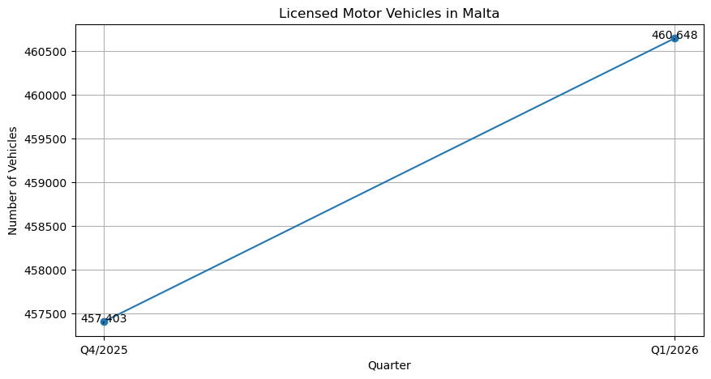

# Malta Motor Vehicles Analysis with Python

## Project Overview

This project analyzes official Malta motor vehicle statistics published by the National Statistics Office (NSO).

The objective is to practice Python data analysis skills using a small real-world dataset.

## Project Objectives

* Collect motor vehicle statistics from official NSO reports.
* Organize data using Python and pandas.
* Analyze changes in licensed motor vehicles between quarters.
* Create visualizations with Matplotlib.
* Communicate findings through charts and observations.

## Dataset

| Period  | Licensed Motor Vehicles | Increase from Previous Quarter |
| ------- | ----------------------: | -----------------------------: |
| Q4/2025 |                 457,403 |                          3,265 |
| Q1/2026 |                 460,648 |                          3,245 |

## Technologies Used

* Python
* pandas
* Matplotlib
* Jupyter Notebook

## Visualization

## Key Findings

* Licensed motor vehicles increased from 457,403 to 460,648.
* The increase between quarters was 3,245 vehicles.
* The growth trend remained positive.
* Vehicle registrations continued to expand in Malta.

## Conclusion

The analysis shows a positive increase in Malta's licensed motor vehicle fleet between Q4/2025 and Q1/2026. Although the growth rate is relatively modest, the trend indicates continued growth in registered vehicles.

## Skills Demonstrated

* Data Analysis
* Data Visualization
* Public Data Analysis
* Python Programming
* pandas
* Matplotlib
* GitHub Documentation
